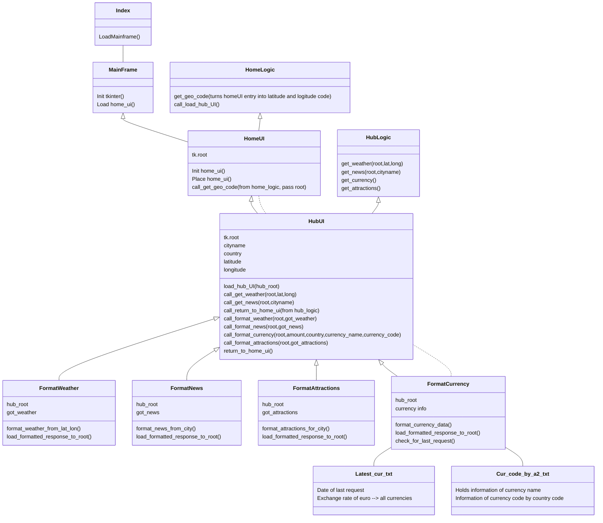

```mermaid
 classDiagram
      
      Index  -- MainFrame
      MainFrame <|-- HomeUI
      HomeLogic <|-- HomeUI
      HomeUI <|-- HubUI
      HubLogic <|-- HubUI
      HubUI ..	HomeUI
      HubUI <|-- FormatWeather
      HubUI <|-- FormatNews
      HubUI <|-- FormatAttractions
      HubUI <|-- FormatCurrency
      FormatCurrency .. HubUI
      FormatCurrency -- Latest_cur_txt
      FormatCurrency -- Cur_code_by_a2_txt

       
      Index : LoadMainframe()

      class MainFrame{
  	  Init tkinter()
         Load home_ui()
         }

      class HomeUI{
           tk.root
  	  Init home_ui()
         Place home_ui()
         call_get_geo_code(from home_logic, pass root)
         }

      class HomeLogic{
          
  	     get_geo_code(turns homeUI entry into latitude and logitude code)
            call_load_hub_UI()
          
         }

      class HubUI{
           tk.root
           cityname
           country
           latitude
           longitude

  	     load_hub_UI(hub_root)
            call_get_weather(root,lat,long)
            call_get_news(root,cityname)
            call_return_to_home_ui(from hub_logic)
            call_format_weather(root,got_weather)
            call_format_news(root,got_news)
            call_format_currency(root,amount,country,currency_name,currency_code)
            call_format_attractions(root,got_attractions)
            return_to_home_ui()
         }

      class HubLogic{

          get_weather(root,lat,long)
  	  get_news(root,cityname)
          get_currency()
	  get_attractions()  
          
         }

      class FormatWeather{
           hub_root
           got_weather

          format_weather_from_lat_lon()
          load_formatted_response_to_root()
          
         }

      class FormatNews{
           hub_root
           got_news

          format_news_from_city()
          load_formatted_response_to_root()
          
         }


      class FormatCurrency{
           hub_root
           currency info

          format_currency_data()
          load_formatted_response_to_root()
          check_for_last_request()
         }


      class FormatAttractions{
           hub_root
           got_attractions

          format_attractions_for_city()
          load_formatted_response_to_root()

         }

     
      class Latest_cur_txt{
           Date of last request
	   Exchange rate of euro --> all currencies

         }

      class Cur_code_by_a2_txt{
           Holds information of currency name
	   Information of currency code by country code

         }
```
