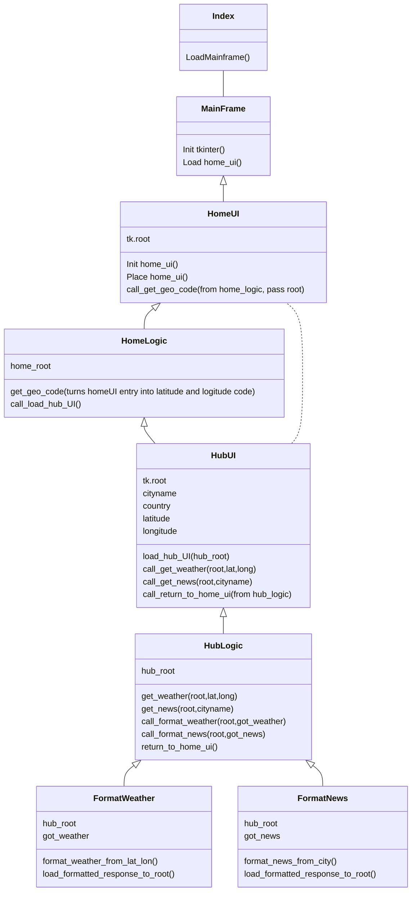

```mermaid
 classDiagram
      
      Index  -- MainFrame
      MainFrame <|-- HomeUI
      HomeUI <|-- HomeLogic
      HomeLogic <|-- HubUI
      HubUI <|-- HubLogic
      HubUI ..	HomeUI
      HubLogic <|-- FormatWeather
      HubLogic <|-- FormatNews

       
      Index : LoadMainframe()

      class MainFrame{
  	  Init tkinter()
         Load home_ui()
         }

      class HomeUI{
           tk.root
  	  Init home_ui()
         Place home_ui()
         call_get_geo_code(from home_logic, pass root)
         }

      class HomeLogic{
           home_root
  	     get_geo_code(turns homeUI entry into latitude and logitude code)
            call_load_hub_UI()
          
         }

      class HubUI{
           tk.root
           cityname
           country
           latitude
           longitude

  	     load_hub_UI(hub_root)
            call_get_weather(root,lat,long)
            call_get_news(root,cityname)
            call_return_to_home_ui(from hub_logic)
          
         }

      class HubLogic{
           hub_root

          get_weather(root,lat,long)
  	     get_news(root,cityname)
            
            call_format_weather(root,got_weather)
            call_format_news(root,got_news)
            return_to_home_ui()
          
         }

      class FormatWeather{
           hub_root
           got_weather

          format_weather_from_lat_lon()
          load_formatted_response_to_root()
          
         }

      class FormatNews{
           hub_root
           got_news

          format_news_from_city()
          load_formatted_response_to_root()
          
         }

```
