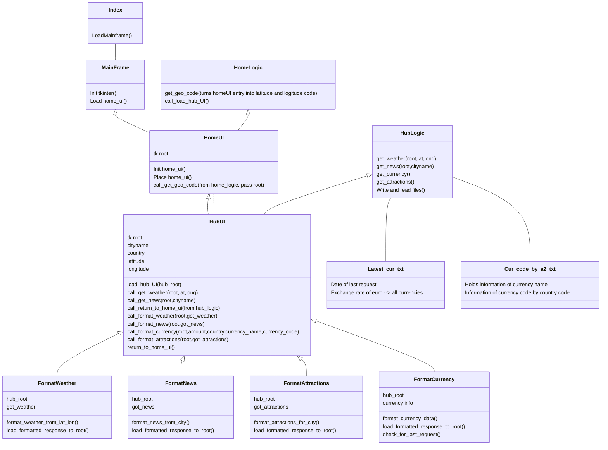

# Sovellusarkkitehtuuri

## Rakenne

**UI** vastaa käyttöliittymästä, se sisältää myös kutsut **Logic** pakkaukseen, joka vastaa API kutsuista, sekä muista sovelluslogiikan operaatioista.
**Logic** pakkaus käyttää hyväkseen **Data Files** pakkauksen sisältämiä tiedostoja, jossa säilytetään tietoa valuuttakursseista, sekä tietoa viimeisen kutsun päivämäärästä.
Saatuaan palautuksen **Logic** pakkaukselta, **UI** kutsuu **API Format** pakkausta, joka vastaa API kutsujen palautteen asettelusta yms.

## Käyttöliittymä

Käyttöliittymä sisältää kaksi näkymää, ensimmäisessä näkymässä syötetään kohdekaupunki, toisessa ns. "päänäkymässä" on tiedot kohteesta. Päänäkymä sisältää myös linkkejä ulkoisiin lähteisiin.

## Sovelluslogiikka

Sovelluksen toiminta perustuu kahden UI tiedoston lähettämiin kutsuihin. Home UI kutsuu HomeLogic tiedostoa saadakseen kohdekaupungin korkeus ja leveyspiirit, mikäli HomeLogic API kutsu epäonnistuu, pyydetään käyttäjältä uutta syötettä. Mikäli kutsu on suotuisa, antaa HomeUI palautuksen HUBUI:lle tätä kutsuessaan.

HUBUI taas kutsuu HUBLogic tiedostoa, joka vastaa HUB sivun API kutsuita ja muusta logiikasta. HUBLogic hakee tarpeelliset tiedot API kutsuilla ja palauttaa ne HUBUI tiedostolle. Valuuttakurssien kohdalla suoritetaan ensin kutsu cur_code_by_a2.txt tiedostoon, joka palauttaa kohdemaan valuuttakoodin HomeLogic(get_geocode) funktion palauttaman maakoodin pohjalta. Kun valuuttakoodi on haettu, suoritetaan tarkistus viimeisen API kutsun päivämäärästä.

Mikäli viimeinen valuuttakutsu on yli päivän vanha, lähetetään uusi API kutsu, jonka palautus kirjoitetaan kyseisen päivämäärän kanssa latest_cur.txt tiedostoon. Tämän jälkeen lates_cur.txt tiedostosta haetaan kohdemaan valuutakurssi Euroon nähden, jonka jälkeen se palautetaan HUBUI:lle.

Kun tarpeelliset kutsut on suoritettu ja tiedot saatu HUBLogic:ilta, HUBUI kutsuu FormatAPI pakkauksen sisältämiä tiedostoja, jotka vastaavat aihekohtaisesti API vastausten lopullisesta asettelusta, fonttikoosta yms. käyttöliittymän ulkoasuun liittyvistä tekijöistä. 

Alla ohjelman kutsulogiikka kokonaisuudessaan:

## Tiedon tallennus
