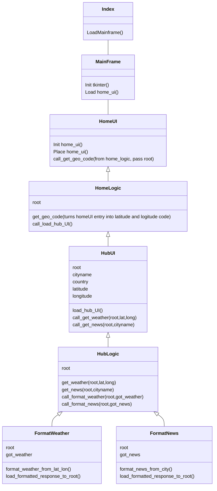

Luokkakaavio toistaiseksi, ohjelmaa ei ole vielä jaettu erillisiin tiedostoihin joten luokkien nimet ja väliset suhteet tulevat varmasti kokemaan muutoksia sovelluksen edetessä.
Ideana on kuitenkin se että GetGeoCode funktion syötettä "kannetaan" mukana eri funktioiden välillä joita kutsutaan syötteellä.
