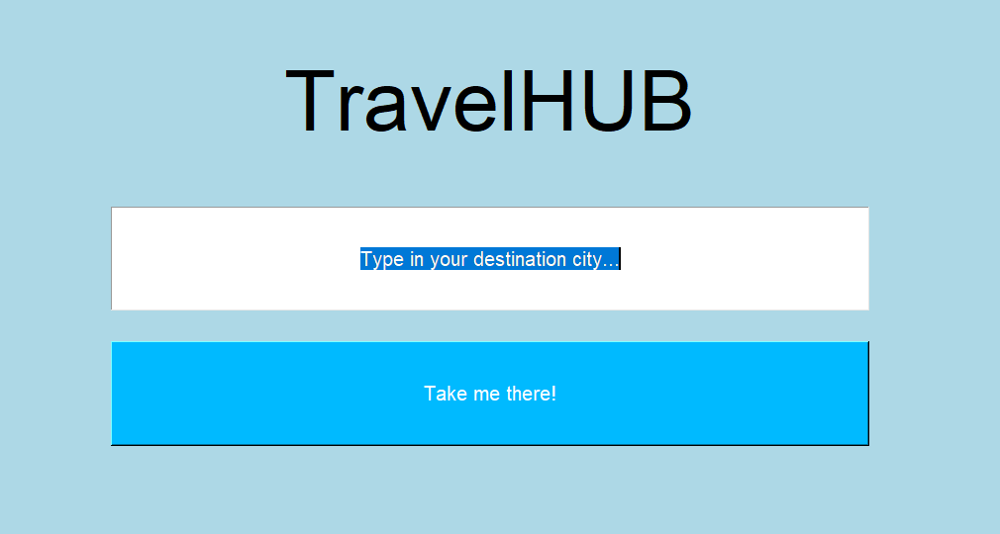
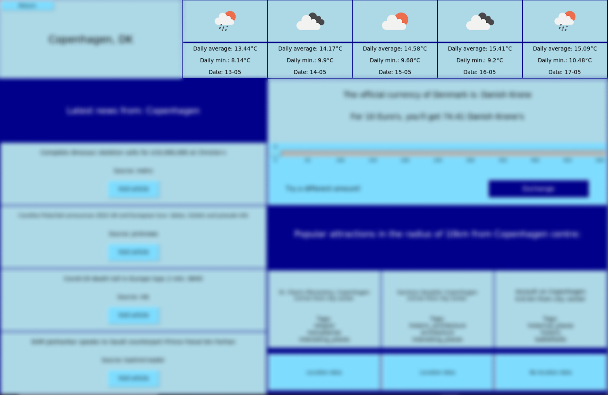
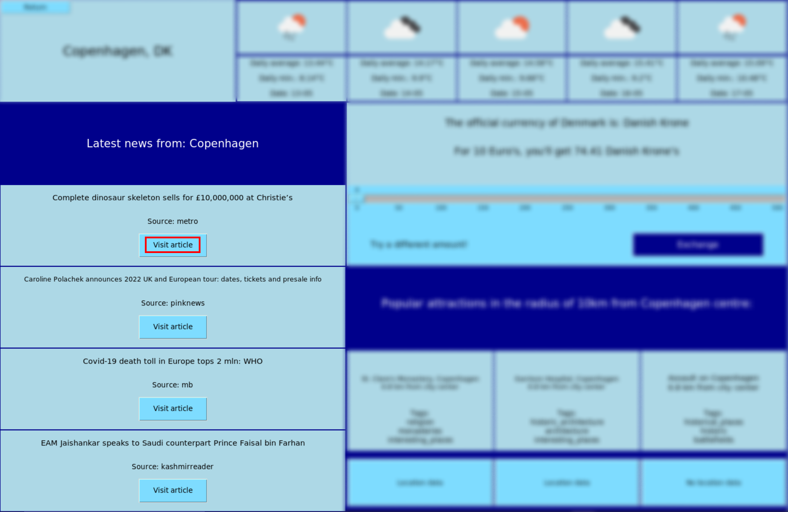
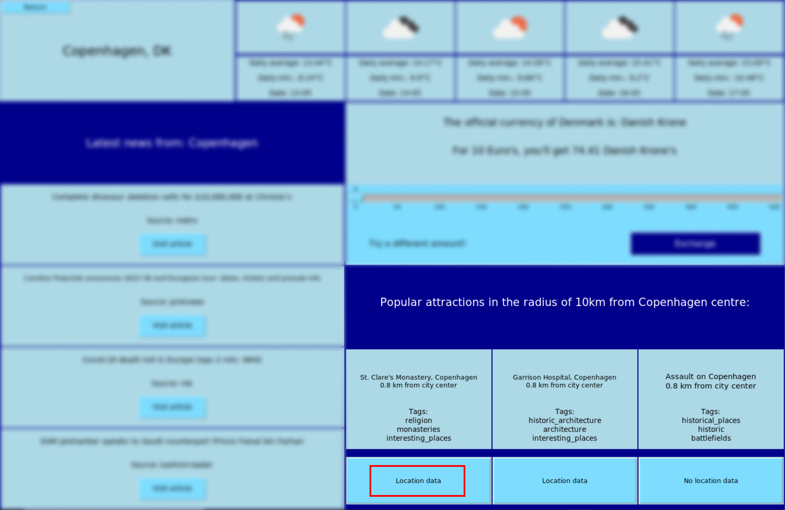

# Käyttö-ohje

 Projektin viimeisimmän julkaisun voi ladata avaamalla "Releases" sivupaneelista viimeisen julkaisun, josta pääsee lataamaan source code (zip) tiedoston.

## Ohjelman käynnistäminen

### Asennus

 Sovelluksen käynnistämistä varten tarvittavat riippuvuudet asennetaan komennolla:

```bash
poetry install
```

### Suorita ohjelma

```bash
poetry run invoke start
```

## Käyttöliittymä

### Etusivu

 Etusivun käyttöliittymä on hyvin suoraviivainen. Kirjoita haluamasi kaupungin nimi tekstikenttään ja paina "Take me there" painiketta (suurkaupungit tuottavat parempia hakuja, sillä esim. Espoosta ei välttämättä löydy globaalin tason uutisia).




### HUB-sivu

 HUB-sivulle aukeaa näkymä kohde-kaupungin tilasta:


#### Return
"Return" painike palaa etusivulle.


#### Weather
Weather osio näyttää kohteen viiden päivän sää-ennusteen.


#### News
News osio näyttää viimeisimmät uutiset kohteesta. "Visit article" painikkeet avaavat kyseisen uutisen selaimeen.


#### Currency
Currency osio näyttää kohdemaan valuuttakurssin Euroon verrattuna. "Slideria" vetämällä voi vaihtaa oletusarvoa (10€), ja "Exchange" nappia painamalla käyttäjä näkee valitsemansa summan paikallisena valuuttana.


#### Attractions
Attractions osio näyttää kohteen suositut nähtävyyden 10km säteellä keskustasta. "Location data" painikkeet avaavat nähtävyyksien wikidata-artikkelit. 

