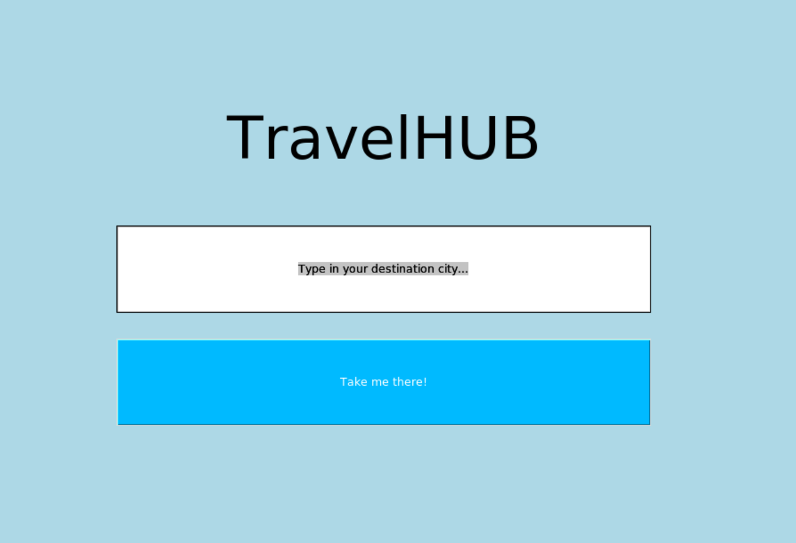

# Käyttö-ohje

 Projektin viimeisimmän julkaisun voi ladata avaamalla "Releases" sivupaneelista viimeisen julkaisun, josta pääsee lataamaan source code (zip) tiedoston.

## Ohjelman käynnistäminen

### Asennus

 Sovelluksen käynnistämistä varten tarvittavat riippuvuudet asennetaan komennolla:

```bash
poetry install
```

### Suorita ohjelma

```bash
poetry run invoke start
```

## Käyttöliittymä

### Etusivu

 Etusivun käyttöliittymä on hyvin suoraviivainen. Kirjoita haluamasi kaupungin nimi tekstikenttään ja paina "Take me there" painiketta (suurkaupungit tuottavat parempia hakuja, sillä esim. Espoosta ei välttämättä löydy globaalin tason uutisia).




### HUB-sivu

 HUB-sivulle aukeaa näkymä kohde-kaupungin tilasta:


- "Return" painike palaa etusivulle (merkitty vihreällä)
- "Visit article" painikkeet avaavat kyseisen uutisen selaimeen (merkitty punaisella)
- "Veto-valikko" ja "Exchange" painike mahdollistavat erinäisten rahasummien vertaamisen Euron kurssiin (merkitty purppuralla)
- "Location data" painikkeet avaavat nähtävyyksien wikidata artikkelit (merkitty keltaisella) 

