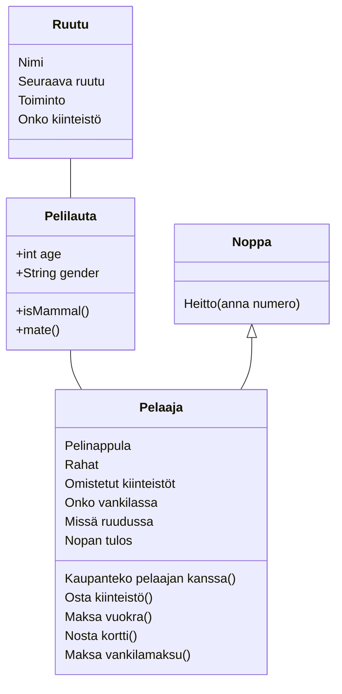

```mermaid
 classDiagram
      Pelilauta -- Pelaaja
      Noppa  <|-- Pelaaja
      Ruutu -- Pelilauta
      Pelilauta : +int age
      Pelilauta : +String gender
      Pelilauta: +isMammal()
      Pelilauta: +mate()

      class Pelaaja{
          Pelinappula
          Rahat
          Omistetut kiinteistöt  
          Onko vankilassa
          Missä ruudussa
          Nopan tulos
          
          Kaupanteko pelaajan kanssa()
          Osta kiinteistö()
          Maksa vuokra()
          Nosta kortti()
          Maksa vankilamaksu()  
      }

      class Noppa{
          Heitto(anna numero)
      }

      class Ruutu{
          Nimi
          Seuraava ruutu
          Toiminto
          Onko kiinteistö
      }
```
