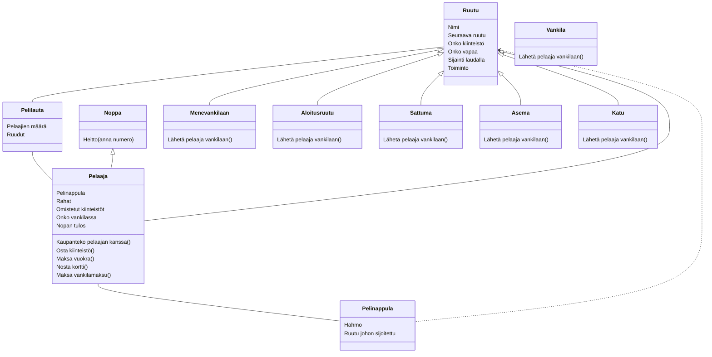

```mermaid
 classDiagram
      Pelilauta -- Pelaaja
      Noppa  <|-- Pelaaja
      Ruutu  <|-- Menevankilaan
      Ruutu  <|-- Aloitusruutu
      Ruutu  <|-- Sattuma
      Ruutu  <|-- Asema
      Ruutu  <|-- Katu
      Ruutu  <|-- Pelaaja
      Ruutu -- Pelilauta
      Pelaaja -- Pelinappula
      Ruutu <.. Pelinappula
      Pelilauta : Pelaajien määrä  
      Pelilauta : Ruudut

      class Pelaaja{
          Pelinappula
          Rahat
          Omistetut kiinteistöt  
          Onko vankilassa
          Nopan tulos
          
          Kaupanteko pelaajan kanssa()
          Osta kiinteistö()
          Maksa vuokra()
          Nosta kortti()
          Maksa vankilamaksu()  
      }

      class Pelinappula{
          Hahmo
          Ruutu johon sijoitettu
      }

      class Noppa{
          Heitto(anna numero)
      }

      class Ruutu{
          Nimi
          Seuraava ruutu
          Onko kiinteistö
          Onko vapaa
          Sijainti laudalla
          Toiminto
      }

      class Menevankilaan{
          Lähetä pelaaja vankilaan()
      }
      class Vankila{
          Lähetä pelaaja vankilaan()
      }
      class Aloitusruutu{
          Lähetä pelaaja vankilaan()
      }
      class Sattuma{
          Lähetä pelaaja vankilaan()
      }

      class Asema{
          Lähetä pelaaja vankilaan()
      }

      class Katu{
          Lähetä pelaaja vankilaan()
      }
```
