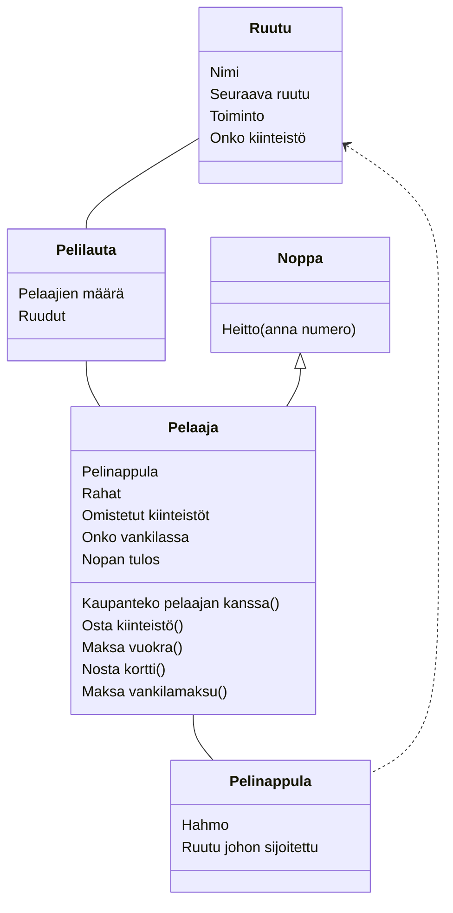

```mermaid
 classDiagram
      Pelilauta -- Pelaaja
      Noppa  <|-- Pelaaja
      Ruutu -- Pelilauta
      Pelaaja -- Pelinappula
      Ruutu <.. Pelinappula
      Pelilauta : Pelaajien määrä  
      Pelilauta : Ruudut

      class Pelaaja{
          Pelinappula
          Rahat
          Omistetut kiinteistöt  
          Onko vankilassa
          Nopan tulos
          
          Kaupanteko pelaajan kanssa()
          Osta kiinteistö()
          Maksa vuokra()
          Nosta kortti()
          Maksa vankilamaksu()  
      }
      
      class Pelinappula{
          Hahmo
          Ruutu johon sijoitettu
      }

      class Noppa{
          Heitto(anna numero)
      }

      class Ruutu{
          Nimi
          Seuraava ruutu
          Toiminto
          Onko kiinteistö
      }


```
