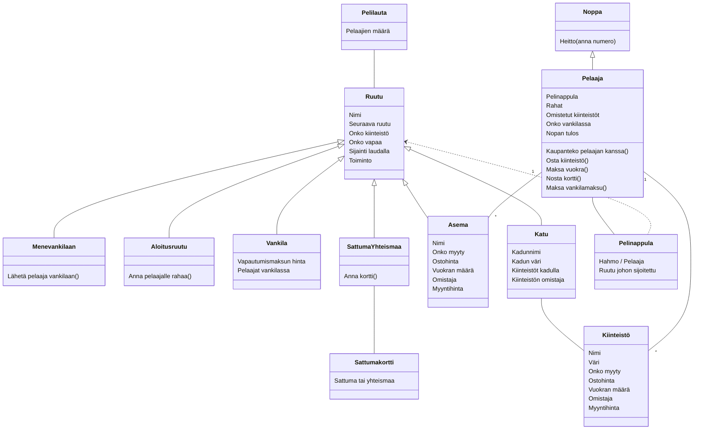

```mermaid
 classDiagram
      
      Noppa  <|-- Pelaaja
      Ruutu  <|-- Menevankilaan
      Ruutu  <|-- Aloitusruutu
      Ruutu  <|-- Vankila
      Ruutu  <|-- SattumaYhteismaa
      Ruutu  <|-- Asema
      Ruutu  <|-- Katu
      Pelilauta -- Ruutu
      Katu -- Kiinteistö
      Pelaaja "1" -- "*" Kiinteistö
      Pelaaja "1" -- "*" Asema
      Pelaaja -- Pelinappula
      Ruutu <.. Pelinappula
      SattumaYhteismaa -- Sattumakortti 

      Pelilauta : Pelaajien määrä  

      class Pelaaja{
          Pelinappula
          Rahat
          Omistetut kiinteistöt  
          Onko vankilassa
          Nopan tulos
          
          Kaupanteko pelaajan kanssa()
          Osta kiinteistö()
          Maksa vuokra()
          Nosta kortti()
          Maksa vankilamaksu()  
      }

      class Pelinappula{
          Hahmo / Pelaaja
          Ruutu johon sijoitettu
      }

      class Noppa{
          Heitto(anna numero)
      }

      class Ruutu{
          Nimi
          Seuraava ruutu
          Onko kiinteistö
          Onko vapaa
          Sijainti laudalla
          Toiminto
      }

      class Menevankilaan{
          Lähetä pelaaja vankilaan()
      }
      class Vankila{
          Vapautumismaksun hinta
          Pelaajat vankilassa
      }
      class Aloitusruutu{
          Anna pelaajalle rahaa()
      }
      class SattumaYhteismaa{
          Anna kortti()
      }

      class Sattumakortti{
          Sattuma tai yhteismaa
      }

      class Asema{
          Nimi
          Onko myyty
          Ostohinta
          Vuokran määrä
          Omistaja
          Myyntihinta
      }

      class Katu{
          Kadunnimi
          Kadun väri
          Kiinteistöt kadulla
          Kiinteistön omistaja
      }

      class Kiinteistö{
          Nimi
          Väri
          Onko myyty
          Ostohinta
          Vuokran määrä
          Omistaja
          Myyntihinta
      }
```
