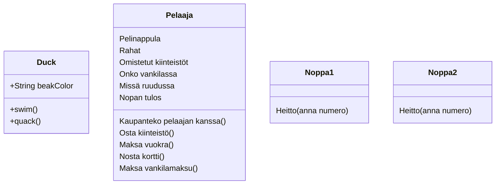

```mermaid
 classDiagram
      class Duck{
          +String beakColor
          +swim()
          +quack()
      }
      class Pelaaja{
          Pelinappula
          Rahat
          Omistetut kiinteistöt  
          Onko vankilassa
          Missä ruudussa
          Nopan tulos
          

          Kaupanteko pelaajan kanssa()
          Osta kiinteistö()
          Maksa vuokra()
          Nosta kortti()
          Maksa vankilamaksu()  

      }
      class Noppa1{
          Heitto(anna numero)
      }

      class Noppa2{
          Heitto(anna numero)
      }

```
