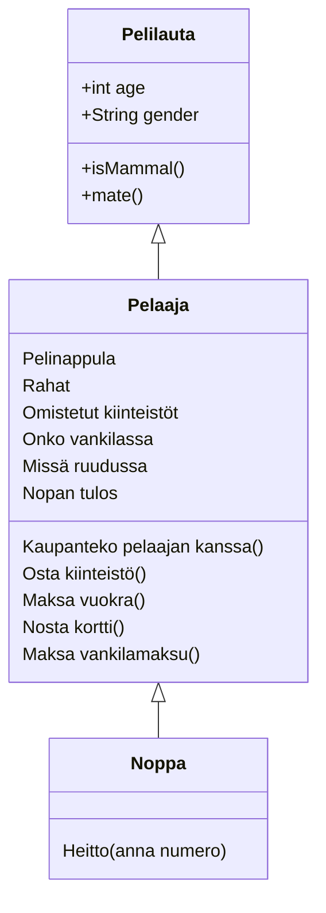

```mermaid
 classDiagram
      Pelilauta <|-- Pelaaja
      Pelaaja  <|-- Noppa 
      Pelilauta : +int age
      Pelilauta : +String gender
      Pelilauta: +isMammal()
      Pelilauta: +mate()

      class Pelaaja{
          Pelinappula
          Rahat
          Omistetut kiinteistöt  
          Onko vankilassa
          Missä ruudussa
          Nopan tulos
          

          Kaupanteko pelaajan kanssa()
          Osta kiinteistö()
          Maksa vuokra()
          Nosta kortti()
          Maksa vankilamaksu()  

      }
      class Noppa{
          Heitto(anna numero)
      }

```
