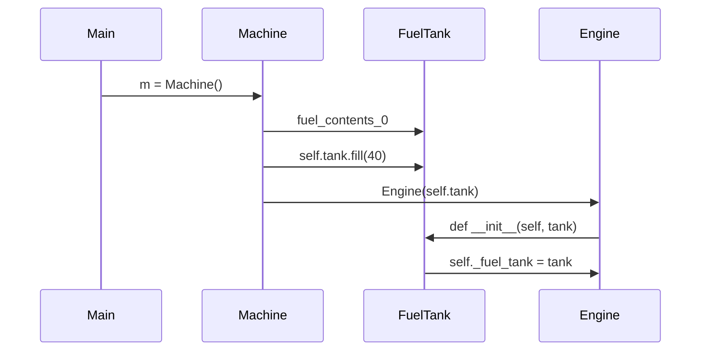

```mermaid
 sequenceDiagram
     Main->>Machine: m = Machine()
     Machine->>FuelTank: fuel_contents_0
     Machine->>FuelTank: self.tank.fill(40)
     Machine->>Engine: Engine(self.tank)
     Engine->>FuelTank: def __init__(self, tank)
     FuelTank->>Engine: self._fuel_tank = tank
```