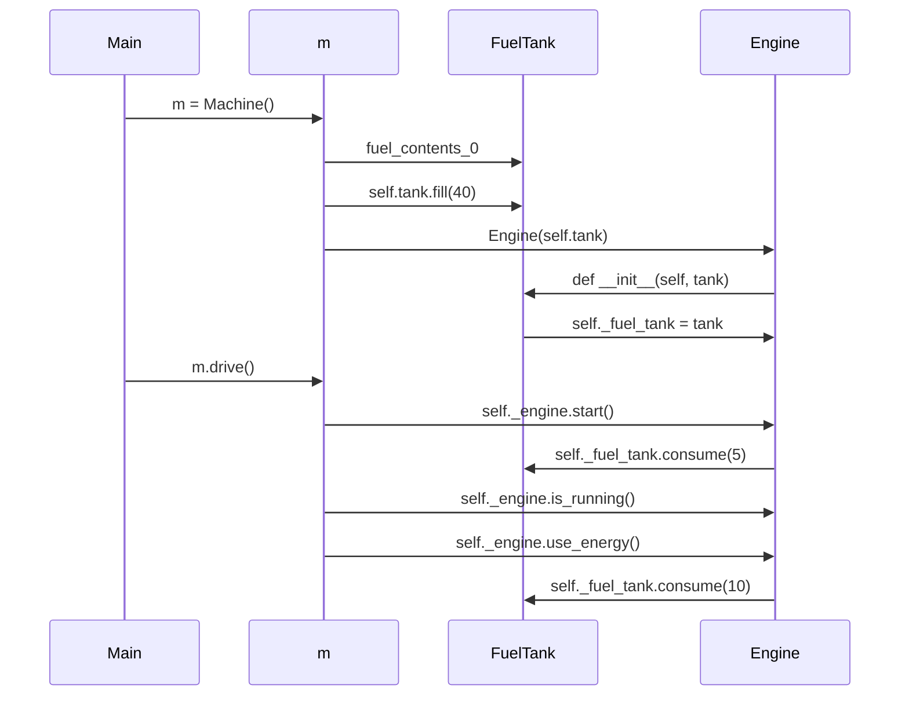

```mermaid
 sequenceDiagram
     Main->>m: m = Machine()
     m->>FuelTank: fuel_contents_0
     m->>FuelTank: self.tank.fill(40)
     m->>Engine: Engine(self.tank)
     Engine->>FuelTank: def __init__(self, tank)
     FuelTank->>Engine: self._fuel_tank = tank
     Main->>m: m.drive()
     m->>Engine: self._engine.start()
     Engine->>FuelTank: self._fuel_tank.consume(5)
     m->>Engine: self._engine.is_running()
     m->>Engine: self._engine.use_energy()
     Engine->>FuelTank: self._fuel_tank.consume(10)
```
