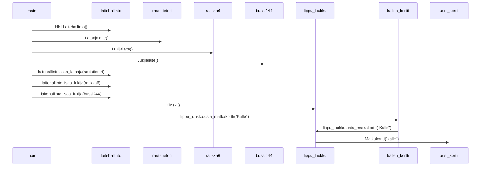

```mermaid
 sequenceDiagram
     main->>laitehallinto: HKLLaitehallinto()
     main->>rautatietori : Lataajalaite()
     main->>ratikka6 : Lukijalaite()
     main->>bussi244 : Lukijalaite()
     main->>laitehallinto: laitehallinto.lisaa_lataaja(rautatietori)
     main->>laitehallinto: laitehallinto.lisaa_lukija(ratikka6)
     main->>laitehallinto: laitehallinto.lisaa_lukija(bussi244)
     main->>lippu_luukku: Kioski()
     main->>kallen_kortti: lippu_luukku.osta_matkakortti("Kalle")
     kallen_kortti->>lippu_luukku: lippu_luukku.osta_matkakortti("Kalle")
     lippu_luukku->>uusi_kortti: Matkakortti("kalle")
```