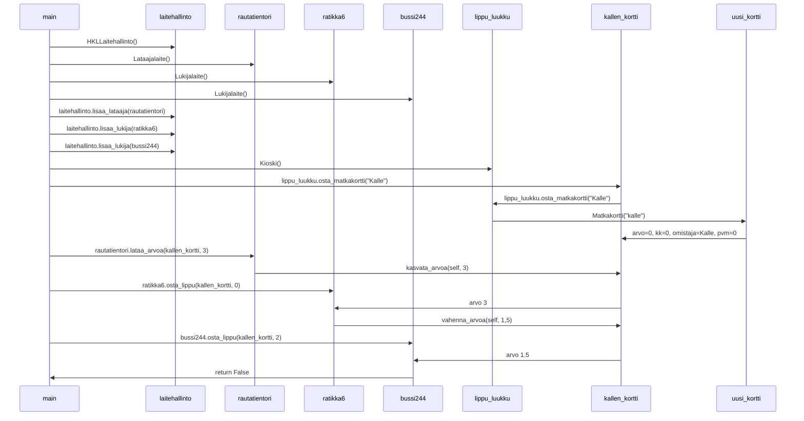

```mermaid
 sequenceDiagram
     main->>laitehallinto: HKLLaitehallinto()
     main->>rautatientori : Lataajalaite()
     main->>ratikka6 : Lukijalaite()
     main->>bussi244 : Lukijalaite()
     main->>laitehallinto: laitehallinto.lisaa_lataaja(rautatientori)
     main->>laitehallinto: laitehallinto.lisaa_lukija(ratikka6)
     main->>laitehallinto: laitehallinto.lisaa_lukija(bussi244)
     main->>lippu_luukku: Kioski()
     main->>kallen_kortti: lippu_luukku.osta_matkakortti("Kalle")
     kallen_kortti->>lippu_luukku: lippu_luukku.osta_matkakortti("Kalle")
     lippu_luukku->>uusi_kortti: Matkakortti("kalle")
     uusi_kortti->>kallen_kortti: arvo=0, kk=0, omistaja=Kalle, pvm=0
     main->>rautatientori : rautatientori.lataa_arvoa(kallen_kortti, 3)
     rautatientori->>kallen_kortti: kasvata_arvoa(self, 3)
     main->>ratikka6: ratikka6.osta_lippu(kallen_kortti, 0)
     kallen_kortti->>ratikka6: arvo 3
     ratikka6->>kallen_kortti: vahenna_arvoa(self, 1,5)
     main->>bussi244: bussi244.osta_lippu(kallen_kortti, 2)
     kallen_kortti->>bussi244: arvo 1.5
     bussi244->>main: return False

```